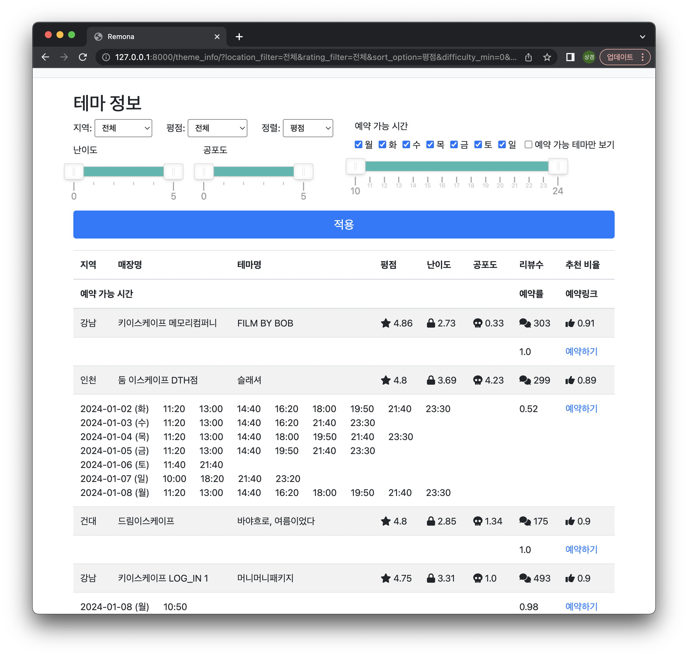
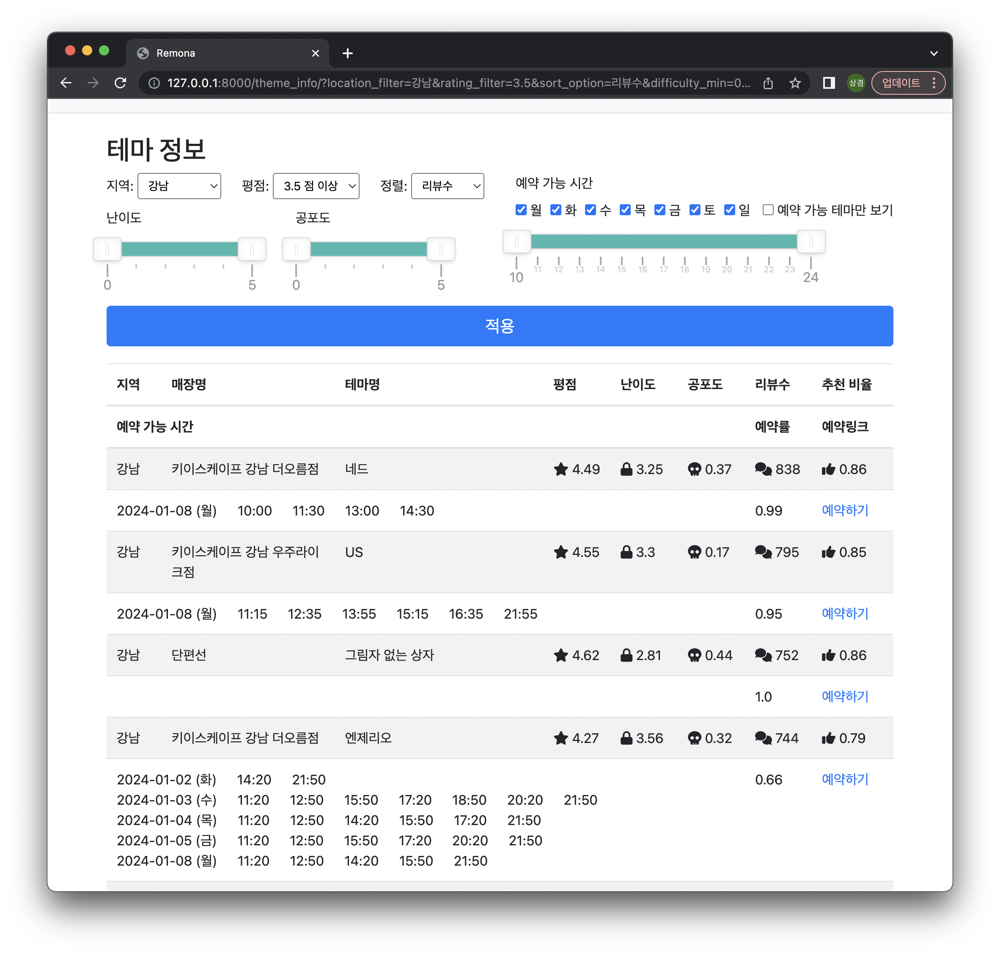
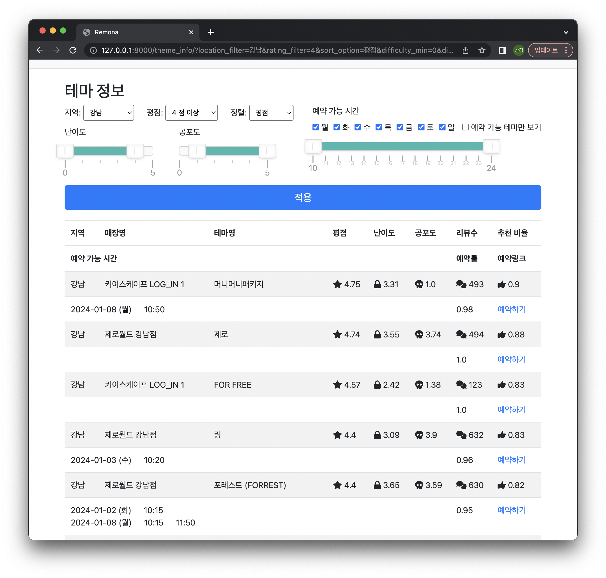
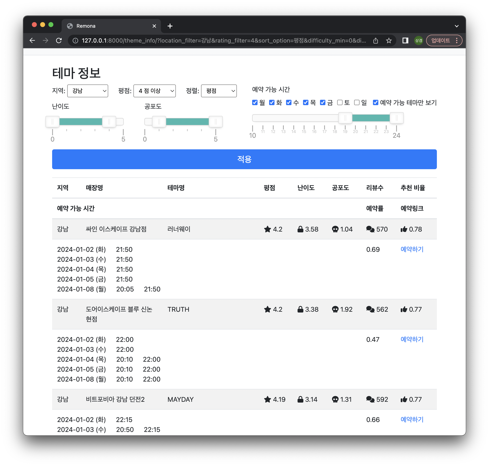

# Remona
### 개요
"Remona"는 Reservation(예약)  + _Aegypius monachus_(독수리의 학명) 의 합성어입니다.
예약에 필요한 정보를 독수리처럼 빠르고 정확하게 제공하는 서비스를 지향합니다.

이 서비스는 사용자가 필요한 예약정보를 기존 시스템보다 정확하게 얻을 수 있도록 설계되었습니다.
방탈출 카페 예약 시 원하는 조건의 예약 가능한 테마를 쉽게 확인하기 어렵다는 문제를 해결하는 데 중점을 두었습니다.

Remona의 목표는 다양한 예약 상황에 맞춤화된 솔루션을 제공하여 예약의 불펀함을 줄이고 사용자에게 더 나은 예약 경험을 제공하는 것입니다.

### 화면 설명

검색 조건
- 지역 필터: 매장 위치별 1depth 지역 선택 필터 (todo: 2depth 필터 적용)
- 평점 필터: 0.5단위 최소 평점 선택 필터
- 난이도 필터: 0.1단위 난이도 슬라이더 필터
- 공포도 필터: 0.1단위 공포도 슬라이더 필터
- 예약 가능 시간 필터: 향후 일주일 요일 필터 체크박스 및 시간단위 예약 시간 슬라이더 필터
- 정렬: 평점, 난이도, 리뷰수, 추천비율, 예약률 선택 내림차순 정렬

결과 화면
- 검색 결과: 검색 조건을 충족하는 테마의 지역, 매장명, 테마명, 평점, 난이도, 공포도, 리뷰수, 추천비율 출력
- 결과 상세
  - 예약 가능 시간: 향후 일주일의 날짜별 예약 가능 시간 출력
  - 예약률: 최근 일주일 예약 완료 비율을 출력
  - 예약 링크: 매장별 예약 사이트 이동 링크

- 지역필터, 평점필터 적용 및 리뷰수 정렬 예시

- 난이도필터, 공포도필터 적용 및 평점 정렬 예시

- 예약 가능 요일 및 시간필터 적용 예시 

### ETL 구성

